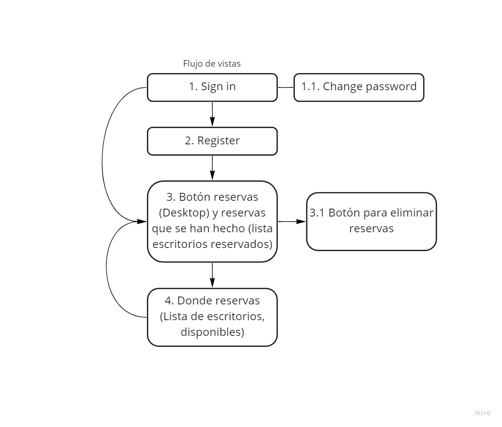

# Workplace management

## What is this App for?
We made this App like a way to show how much we learned in the fundations phase in [Holberton School](https://www.holbertonschool.com/). For this reservation project we use Django to build the Back-end, Postgresql to manage the database and Bootstrap with React to give the App a beautiful and responsive Front-end.

## What is this App does?
This application was thought to be use by the employees of a company, this one wanted to manage the work on site through a web reservations tool. The big picture of this application is save the start date and time of the reservation and the end too. Taking that in account we made an App with the components and views list below:

* Login page
* Sing Up page
* Reserved list page
* Reservation page

## Site flow

## Features

## How to use it?

## Challenges
* For this project we learned the Python framework Django Rest and the Javascript framework React.
* Use Bootstrap with React.
* Connect Back-end and Front-end.
* Implement the login token and the logout.

## Future of Workplace Management

## About us

